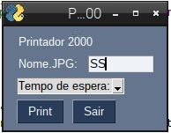

# Função de Screenshot para Raspberry Pi OS

Aplicativo que realiza capturas de tela em um sistema que não possui nativamente essa função. O ambiente alvo e de teste foi um Raspberry Pi 3b com o sistema operacional baseado em Debian chamado Raspbian.

Desenvolvido na linguagem Python com o uso das bibliotecas: PySimpleGUI, Times, OS e Pyscreenshot.

Interface Grafica, Salvamento em qualquer caminho/diretório, Captura de Tela Instantânea ou condicionada com a possibilidade de determinar um temporizador.

## Screenshot da Interface Gráfica da Aplicação:
Por ser uma aplicação destinada à dispositivos raspberry pi, aqui está a captura de tela da aplicação rodando em tal dispositivo.

Interface feita com a biblioteca PySimpleGUI.

